> These notes are from a series of lectures by Leonard Susskind, entitled [The Theoretical Minimum: Classical Mechanics](https://www.youtube.com/playlist?list=PL47F408D36D4CF129). There is also a book based on these lectures, but my notes are a lot more concise and are the result of furious scribbles taken during lectures.

## Discrete systems {.allowframebreaks}

For any physical system, we have two main questions:

1. What laws are there for a particular type of system?
2. What are the rules for the allowable laws?

Consider a **coin**. It has two states/configurations/values: heads or tails. If we put a coin on a table, its initial condition is either heads or tails, and our law of motion is that it **stays the same**. In other words, at any point in time, we have that

$$H \to H, \quad T \to T.$$

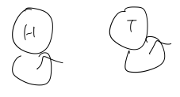{width=25%}

But we could also construct a system where the law of motion is that at any point of time, the coin **switches**; that is,

$$H \to T, \quad T \to H.$$

{width=20%}

We can define a function $\sigma(t)$ that tells us about the side of the coin at the next point in time $t+1$ given some time $t$ (for our cases, we can assume that $t \in \mathbb Z$). We have

$$\sigma(t) = \begin{cases} 1 & \text{heads} \\ 0 & \text{tails} \end{cases}$$

We can define our first law of motion, the one where we had the coin staying still, with the equation $\sigma(t+1) = \sigma(t)$. Similarly, we can express our second law of motion, the one where the coin switches at every time interval, as $\sigma(t+1) = -\sigma(t)$. Notice that both systems are completely deterministic (predictive). If we intervene, then we are breaking the closed system. In closed systems, laws are entirely deterministic.

Now consider a **die**. It has a set of configurations $\{1,2,3,4,5,6\}$. We could express any laws of motion we come up with as a graph, such as

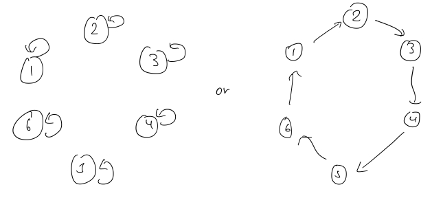{width=70%}

Once again, these laws are completely deterministic. We could also consider

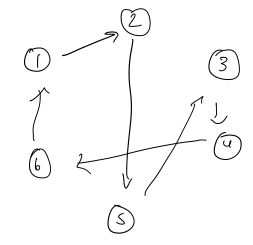{width=30%}

This is logically equivalent to the above; just relabel the numbers. But one could devise something like this:

{width=30%}

This is **not** logically equivalent, because if you are in one cycle you won't get to the other one. This is called a **conserved quantity**, and its law is a conservation law. We can put states $1,2,3$ into some group A, and states $4,5,6$ into some group B. If we are in group A, we stay in group A. Similarly, if we are in group B, we stay in group B.

We can also consider

{width=30%}

If we let group A $=\{1\}$, group B $=\{2,3\}$ and group C $=\{4,5,6\}$, we can also see that these are conserved quantities.

We can now consider some infinite line, where each point is $\in \mathbb Z$.

{width=80%}

A particle has an infinite number of states $\in \mathbb Z$. We could invent laws such as:

- wherever we are, move one unit;
- wherever we are, move two units (in fact, in this instance, we have a conserved quantity: oddness and evenness!);
- etc.

All of the above rules are **allowable laws**. But not all laws are legal. Which are not allowable? Consider a 3-sided coin which can land on its edge, for argument's sake.

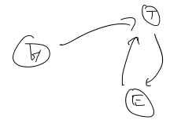{width=30%}

We have a situation of

$$H\to T\to E\to T\to E\cdots, \quad T\to E\to T\to E\cdots, E\to T\to E\to T\cdots,$$

so we can predict into the future...but we **cannot** predict into the past. This means that this is **non-reversible**. How do we check reversibility? Just try reversing each arrow.

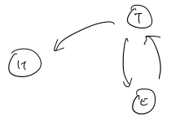{width=30%}

Now we have two arrows coming out of one state? Where do we go? We don't know, so this is not deterministic. This sort of law is not allowed in _classical_ physics.

If we know the initial conditions perfectly, you could predict the future and the past. Otherwise, we would like to quantify how much we can predict. For example, weather forecasters can reasonably predict the weather for 3 days from now, but since the atmosphere is a chaotic system, we might no longer be able to after a few days. The laws of classical mechanics are deterministic into the future and the past.

How does one determine predictibility concretely? It's simple: **one input, one output arrow**.

Let's finally get into some real world physics: **point particles in space**. What are the configuraions of a point particle?

## Super basic math review {.allowframebreaks}

Let's look at the standard Cartesian coordinate system in 3 dimensions.

{width=35%}

A point is labelled with coordinates $(x,y,z)$. The standard direction of the $z$ is determined by the right-hand-rule.

A **vector** has both length and direction. Example: position of point relative to origin (but origin-independent). Typically, vectors are denoted $\vec v$. The length is denoted $|\vec v|$, and the direction is harder to write down. We can define the vector as well by connecting each coordinate to the basis vectors:

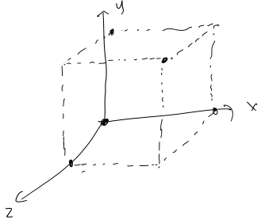{width=35%}

For our cases, we denote the components $v_x, v_y, v_z$.

We now look at some basic facts about the algebra of vectors. If $c \in \mathbb R$, then $c \vec A$ is the vector $\vec A$, but $c$ times as long. If we take $-\vec A$, it is $\vec A$ but in the opposite (negative) direction. We can **add** vectors geometrically:

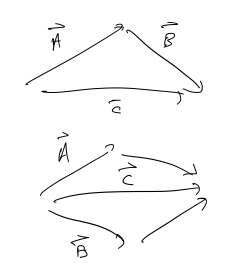{width=30%}

or algebraically by summing the components,

$$C_x = A_x + B_x \quad \implies \quad C_i = A_i + B_i, \quad \forall i.$$

Can we multiply vectors? Yes, in two main different ways. Can we divide vectors? Uhh...not really well defined. We'll look at the dot product method of multiplying vectors.

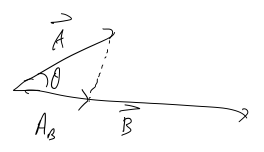{width=35%}

The **dot product** is defined as $\vec A \cdot \vec B = |\vec A| |\vec B| \cos \theta$, where $\theta$ is the angle between the vectors. The dot product is commutative; that is, $\vec A \cdot \vec B = \vec B \cdot \vec A$. We also have that $\vec A \cdot \vec A = |\vec A|^2$. We can also use the dot product as a nice way to compute the angle between two vectors.

Now let us prove the law of cosines.

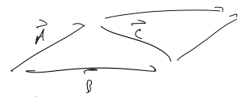{width=35%}

$$
\begin{aligned}
    \vec C \cdot \vec C &= (\vec A - \vec B) \cdot (\vec A - \vec B) \\
    &= \vec A \cdot \vec A + \vec B \cdot \vec B - 2(\vec A \cdot \vec B) \\
    &= |\vec A|^2 + |\vec B|^2 - 2 |\vec A||\vec B|\cos \theta_{\vec A \vec B}
\end{aligned}
$$

## Particle motion {.allowframebreaks}

Consider a particle with vector denoted by $\vec r$ and coordinates $x,y,z$.

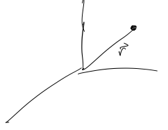{width=30%}

We are generally interested in the motion of particles. The three equations

$$\vec r_x(t) = x(t), \quad \vec r_y(t) = y(t), \quad \vec r_z(t) = z(t)$$

summarise the motion of the particle. We also know that the velocity is the derivative of the particle, so we have

$$v_x = \frac{\mathrm d}{\mathrm dt} r_x = \left(\frac{\mathrm dx}{\mathrm dt}, \frac{\mathrm dy}{\mathrm dt}, \frac{\mathrm dz}{\mathrm dt}\right).$$

We can use Newton's notation

$$\frac{\mathrm df(t)}{\mathrm dt} = \dot f(t), \quad v_i = \frac{\mathrm dx_i}{\mathrm dt} = \dot x_i.$$

We also have that acceleration is the rate of change of velocity. Acceleration also has direction, so we have

$$a_i = \frac{\mathrm d^2 x_i}{\mathrm dt^2} = \ddot x_i = \dot v_i.$$

We can also write

$$\vec v = \frac{\mathrm d}{\mathrm dt} \vec r = \dot{\vec r}, \quad \vec a = \frac{\mathrm d^2}{\mathrm dt^2} \vec r = \ddot{\vec r}.$$

Now consider simple motion along a line. We have

{width=60%}

Suppose that $x(t) = a+bt+ct^2$. We then have that $v(t) = \dot x = b + 2ct$, and $a = \ddot x = 2c$.

We can also look at circular motion on the unit circle.

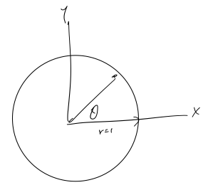{width=30%}

Angle increases with respect to time with rule $\theta = \omega t$. How long does it take to go from $0$ to $2\pi$? We can obtain this by solving $2\pi = \omega t$, which implies

$$t = \frac{2\pi}{\omega} = \mathrm{period}.$$

$\omega$ is called the angular frequency. Parametrising the unit circle, we have

$$x = \cos \omega t, \quad y = \sin \omega t$$

and therefore

$$v_x = -\omega \sin(\omega t), \quad v_y = \omega \cos(\omega t).$$

What is the angle between position and velocity? Intuitively, perpendicular, but we can compute this explicitly using the dot product.

$$x \cdot v_x + y \cdot v_y = -\omega \sin \omega t \cos \omega t + \omega \sin \omega t \cos \omega t = 0$$

therefore the two vectors are orthogonal. For acceleration and position, we can perform a similar calculation:

$$a_x = -\omega^2 \cos (\omega t) ,\quad a_y = -\omega^2 \sin (\omega t).$$

Note that acceleration is parallel to the position vector, but is inwards (as is the case with centrifugal acceleration).